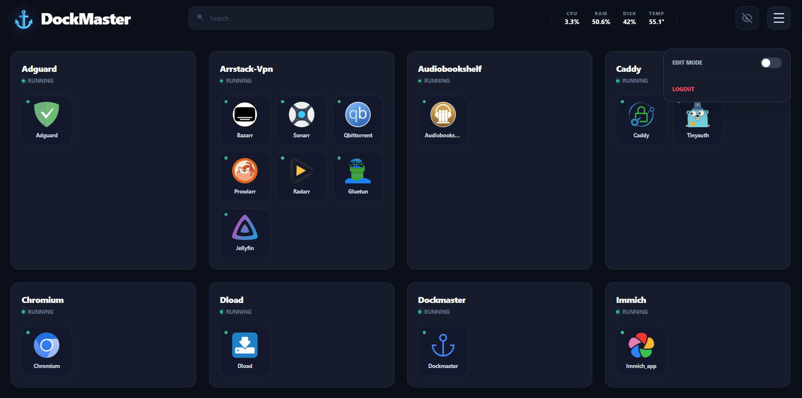
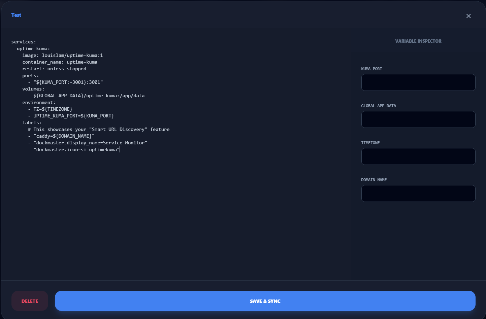
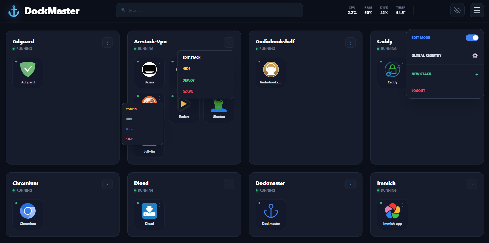
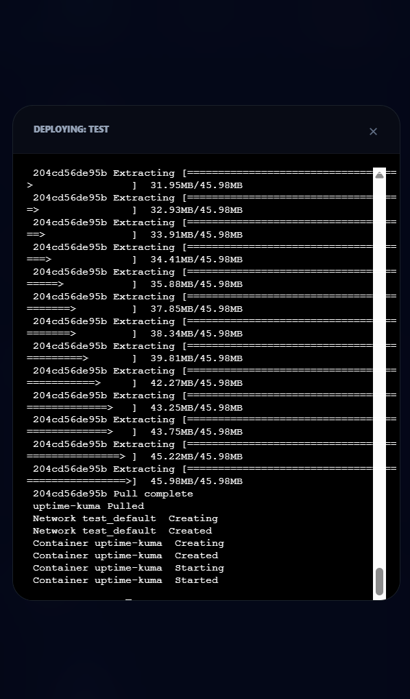
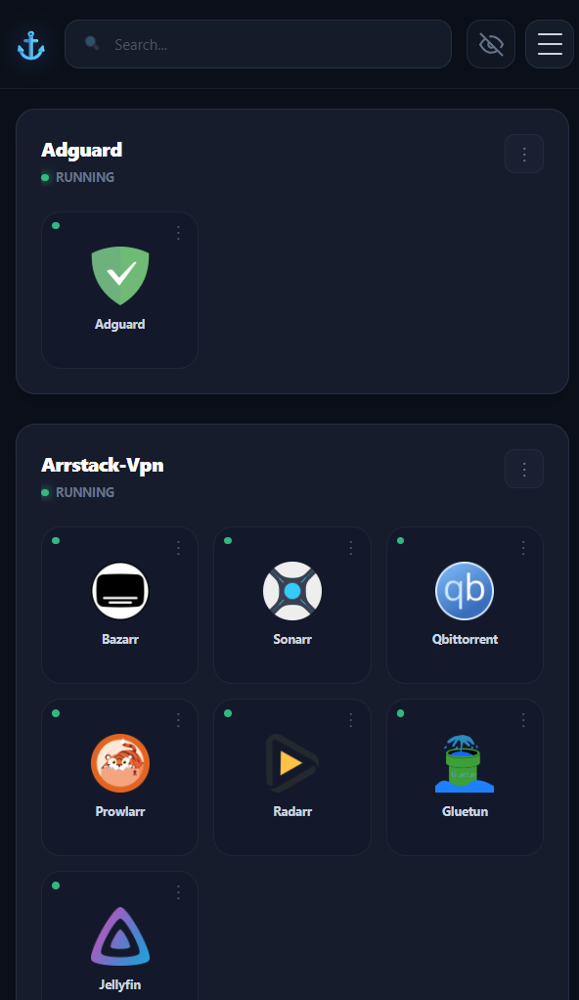
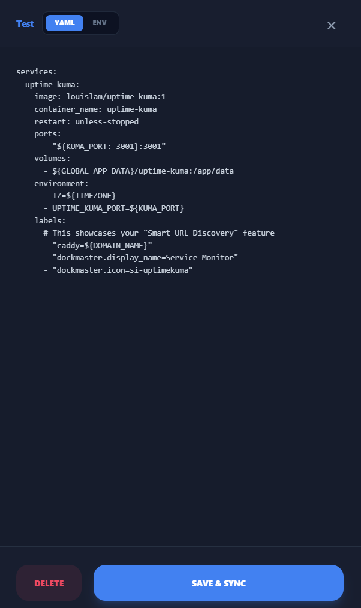
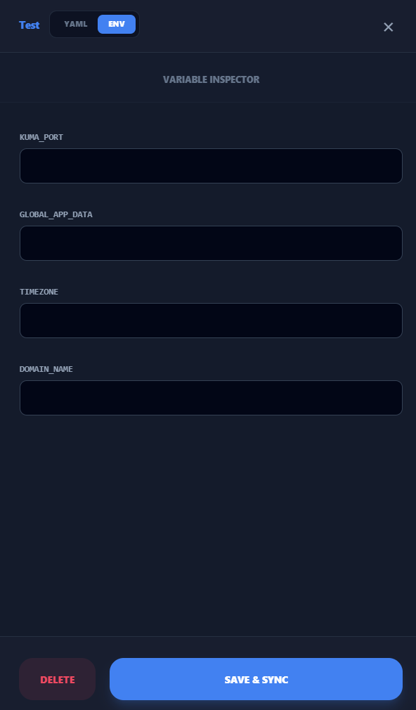
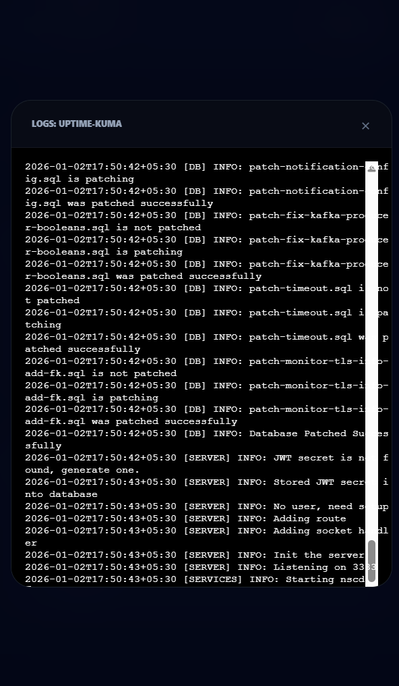

# ⚓ DockMaster

**DockMaster** is a lightweight, high-performance Docker Compose manager designed for Raspberry Pi and home servers. It provides a sleek, modern UI to manage stacks, edit configurations, and monitor system health without the overhead of heavy enterprise tools.

---

## ✨ Key Features

* **🔍 Deep Search & Filtering:** Instantly find services with a global search that crawls through stack names, container names, and custom display aliases.
* **🌍 Global Variable Registry:** Manage one single `.env` file across all your stacks. Save a variable once, use it everywhere.
* **🙈 Intelligent Visibility:** Keep your dashboard clean by hiding stopped containers or manually flagging specific services as "hidden."
* **🛠️ Real-time Stack Editor:** A dual-pane editor featuring a YAML workspace and a **Variable Inspector** that preserves case sensitivity (e.g., `$Db_Password`) and syncs with your Global Registry.
* **📊 Live System Metrics:** Built-in monitoring for CPU, RAM, and Temperature—perfect for keeping an eye on your hardware.
* **⌨️ Integrated Terminal:** Deploy, stop, or view live logs via a high-performance xterm-compatible terminal.
* **🎨 Custom Branding:** Assign custom icons and display names to containers for a personalized dashboard.
* **🔗 Smart URL Recognition:** Automatically detects and generates service links by parsing **Caddy** (Caddy Docker Proxy) labels or **Traefik** routing rules.

---
## 📸 Screenshots

### 🖥️ Desktop Interface
| Dashboard (Main) | Stack Editor & YAML |
| :---: | :---: |
|  |  |

| Edit Options | Deployment Logs |
| :---: | :---: |
|  |  |

---

### 📱 Mobile Optimized
| Dashboard | YAML Editor | Env Editor |
| :---: | :---: | :---: |
|  |  |  |

---

### 🔍 Features in Action
| Container Logs | Visibility Toggle |
| :---: | :---: |
|  |  |

---

## 🌐 Production Deployment

For a production environment, DockMaster is designed to run behind a Reverse Proxy with secure authentication and persistent storage.

### 1. Prerequisites
- **Docker & Docker Compose** installed.
- **Reverse Proxy**: We recommend **Caddy** for automatic SSL.
- **GitHub Registry Access**: DockMaster is hosted on GHCR.

### 2. Prepare Directory Structure
```bash
# Create the standard DockMaster structure
mkdir -p ~/DATA/stacks
mkdir -p ~/AppData/dockmaster/config
cd ~/AppData/dockmaster
```
### 3. Generate Your Password Hash
DockMaster uses **Bcrypt** for security. Use this Docker command to generate a secure hash for your chosen password:

```Bash

docker run --rm python:3.11-slim sh -c "pip install --quiet bcrypt && python -c 'import bcrypt; print(bcrypt.hashpw(\"YOUR_PASSWORD_HERE\".encode(), bcrypt.gensalt()).decode())'"
```

**⚠️ Critical:** When pasting the resulting hash into your `.env` or `docker-compose.yml`, you must escape every `$` sign by doubling it (e.g., change `$2b$` to `$$2b$$`).

### 4. Configure the Environment
Create a `.env` file in your app directory. Important: Use `$$` to escape Bcrypt characters for Docker Compose compatibility.

```Bash
# Public IP or Domain of your host
DOCKER_HOST_IP=your-server-ip-or-domain.com

# Authentication
# Generate JWT_SECRET via: openssl rand -hex 32
JWT_SECRET=4f92...a381
# Use double $$ to escape the salt/hash in YML
DOCKMASTER_PASSWORD_HASH=$$2b$$12....oC2mD0tK

# Path Mappings
STACKS_PATH=${HOME}/DATA/stacks
CONFIG_PATH=${HOME}/AppData/dockmaster/config
```

### 5. Production Docker Compose
Save this as `docker-compose.yml`. This configuration allows DockMaster to act as a "manager" by communicating directly with your host's Docker engine.

```YAML

services:
  dockmaster:
    # Pulls the latest production build from the GitHub Container Registry
    image: ghcr.io/kmrs93/dockmaster:latest
    container_name: dockmaster
    restart: unless-stopped
    
    # Allows the container to see host network interfaces (important for discovery)
    network_mode: "host"
    
    # Allows the container to monitor host processes (used for system metrics)
    pid: "host"
    
    volumes:
      # The "Brain": Gives DockMaster permission to manage other containers
      - /var/run/docker.sock:/var/run/docker.sock
      
      # The "Tools": Passes the host's Docker binaries so the UI can run commands
      - /usr/bin/docker:/usr/bin/docker
      - /usr/libexec/docker/cli-plugins:/usr/libexec/docker/cli-plugins
      
      # The "Storage": Where your docker-compose.yml files and global .env live
      - ${STACKS_PATH}:/app/projects
      - ${CONFIG_PATH}:/app/config
      
      # The "Eyes": Read-only access to host filesystem for hardware stats (CPU temp/usage)
      - /:/host:ro
      
    environment:
      # Internal path mapping for the FastAPI backend
      - STACKS_ROOT=/app/projects
      
      # Your server's IP for generating external links
      - DOCKER_HOST_IP=${DOCKER_HOST_IP}
      
      # Security credentials defined in your local .env
      - DOCKMASTER_PASSWORD_HASH=${DOCKMASTER_PASSWORD_HASH}
      - JWT_SECRET=${JWT_SECRET}
```

### 6. Launch
```Bash
docker compose pull
docker compose up -d
```

### 🛠️ Troubleshooting
1. Clickable URLs not appearing
DockMaster automatically generates URLs by looking for specific labels. Ensure your services use:

    **Caddy:** `caddy: your-domain.com` (as used by `caddy-docker-proxy`)

    **Traefik:** `traefik.http.routers.name.rule: Host('your-domain.com')`

2. Permission Denied on `docker.sock`
If the UI shows errors or cannot list containers, the user running Docker might not have permissions to the socket. Fix: Ensure your user is part of the docker group: `sudo usermod -aG docker $USER`.

3. Password Hash Issues
If you cannot log in, double-check that your Bcrypt hash in the `.env` file uses `$$` instead of `$`.

### 🔒 Security Best Practices
1. Firewall: Ensure port `5555` is only accessible via your internal network or your Reverse Proxy.

2. Docker Socket: Mounting `/var/run/docker.sock` gives the container root-level access to your host. Only deploy this on a secured server you control.

3. Global ENV: DockMaster centralizes variables into one `global.env`. Keep this file backed up as it contains the keys to your entire infrastructure.

### 🛠️ Built With
* **Backend:** [FastAPI](https://fastapi.tiangolo.com/) - High-performance Python framework.
* **Frontend:** [Vue.js 3](https://vuejs.org/) - For a reactive and snappy interface.
* **Styling:** [Tailwind CSS](https://tailwindcss.com/) - Modern utility-first CSS.
* **Terminal:** [Xterm.js](https://xtermjs.org/) - The industry-standard terminal emulator.
* **Container Logic:** [Docker SDK for Python](https://docker-py.readthedocs.io/) - Native interaction with the Docker engine.

### 🎨 Credits & Acknowledgments
* **Icons:** Powered by the excellent [Dashboard Icons](https://github.com/homarr-labs/dashboard-icons) library by Homarr-Labs.
* **AI Thought Partner:** Developed with the assistance of **Gemini**, Google's AI, which helped architect the UI, optimize global variable logic, and refine the codebase.

### 📝 License
MIT
